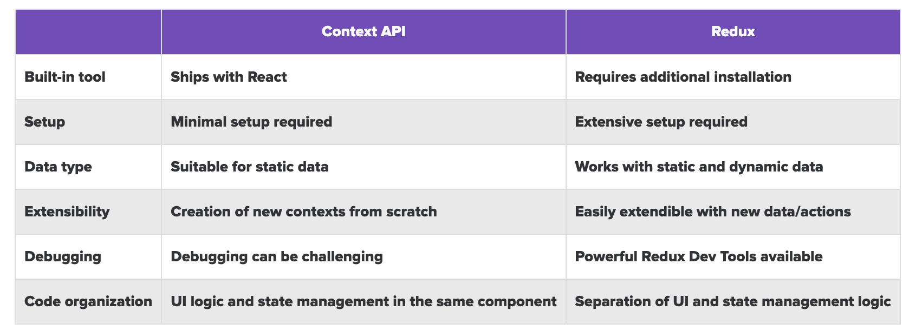

State management is a crucial aspect of React applications. While Redux has been the go-to solution for years, React's Context API and Hooks provide built-in alternatives that might be sufficient for many applications. Let's explore when to use each approach.

### What is State Management in React?

In React, state management becomes necessary when we need to share data between disconnected components. Without a global state solution, developers often resort to prop drilling - passing data through multiple component layers, resulting in:
- Excessive code
- Components receiving props they don't use
- Reduced maintainability
- Complex component hierarchies

### React Context API and Hooks Approach

The Context API combined with Hooks (specifically `useContext` and `useReducer`) provides a built-in solution for state management. Here's how to implement it:

**1. Creating a Context**

```javascript
import { createContext, useReducer } from "react";

const initialState = {
  theme: "light"
};

const store = createContext(initialState);
const { Provider } = store;
```

**2. Setting up the Provider with useReducer**

```javascript
const StateProvider = ({ children }) => {
  const [state, dispatch] = useReducer((state, action) => {
    switch(action.type) {
      case "TOGGLE_THEME":
        return {
          ...state,
          theme: state.theme === "light" ? "dark" : "light"
        };
      default:
        return state;
    }
  }, initialState);

  return <Provider value={{ state, dispatch }}>{children}</Provider>;
};
```

**3. Using the Context in Components**

```javascript
import { useContext } from 'react';
import { store } from './store';

const ThemeToggle = () => {
  const { state, dispatch } = useContext(store);

  return (
    <button onClick={() => dispatch({ type: "TOGGLE_THEME" })}>
      Current theme: {state.theme}
    </button>
  );
};
```

### When to Use Context + Hooks

1. **Small to Medium Applications**
   - When your state management needs are relatively simple
   - When you don't need advanced features like time-travel debugging
   - When you want to avoid external dependencies

2. **Component-Specific State**
   - For state that's specific to a particular feature or component tree
   - When the state updates are infrequent
   - When you need quick setup with minimal boilerplate

### When to Use Redux

1. **Large Applications**
   - Complex state management requirements
   - Multiple state updates happening frequently
   - Need for centralized state management

2. **Advanced Features Needed**
   - Time-travel debugging
   - State persistence
   - Complex middleware requirements
   - Advanced performance optimizations

3. **Team Preferences**
   - When the team is already familiar with Redux
   - Need for standardized state management patterns
   - Large development team working on the same codebase

### Redux Toolkit: The Modern Redux Solution

Redux has evolved with Redux Toolkit, which addresses many of the traditional complaints about Redux:

1. **Reduced Boilerplate**

   ```javascript
   import { createSlice } from '@reduxjs/toolkit'

   const counterSlice = createSlice({
     name: 'counter',
     initialState: 0,
     reducers: {
       increment: state => state + 1,
       decrement: state => state - 1
     }
   })
   ```

2. **Built-in Immutability**
   - Write "mutating" logic that gets translated to immutable updates
   - Simplified reducer code
   - Less error-prone state updates

3. **Integrated DevTools and Middleware**
   - Easy setup of Redux DevTools
   - Built-in Thunk middleware
   - Simplified store configuration

### Performance Considerations

1. **Context API**
   - Re-renders all components using the context when it changes
   - Better for infrequent updates
   - Requires careful structuring to avoid unnecessary re-renders

2. **Redux**
   - Optimized connect HOC prevents unnecessary re-renders
   - Better for frequent updates
   - Built-in performance optimizations

### Best Practices

1. **Start Simple**
   - Begin with local state
   - Move to Context API when prop drilling becomes an issue
   - Consider Redux when you need more advanced features

2. **Structure Your State**
   - Keep state minimal and normalized
   - Split context providers by domain
   - Consider performance implications

3. **Code Organization**
   - Keep related state logic together
   - Use separate files for different contexts/slices
   - Document your state management decisions

### Comparison of Context API and Redux



### Conclusion

The choice between React's Context API with Hooks and Redux isn't always clear-cut. Context with Hooks provides a simpler, built-in solution that's perfect for many applications. However, Redux (especially with Redux Toolkit) remains a powerful choice for complex applications requiring advanced state management features.

Consider your application's needs, team expertise, and future requirements when making this decision. Remember that you can also use both approaches in the same application, using Context for simpler state management and Redux for more complex scenarios.

For more detailed information, refer to:
- [Redux Toolkit Documentation](https://redux-toolkit.js.org/)
- [React Context Documentation](https://react.dev/reference/react/useContext)
- [React Hooks vs. Redux: Do Hooks and Context replace Redux?](https://blog.logrocket.com/react-hooks-vs-redux-hooks-context-replace-redux/)

